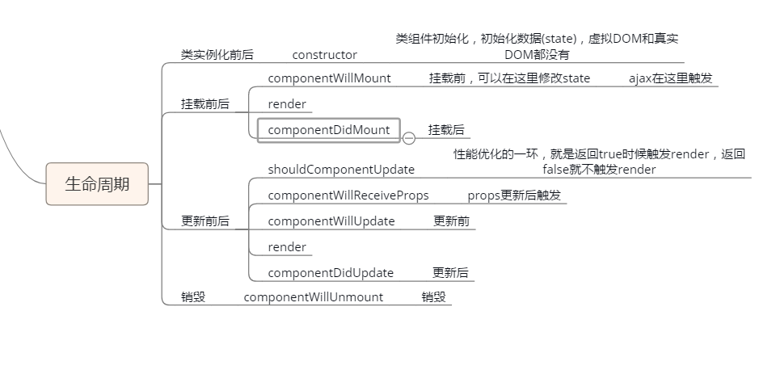
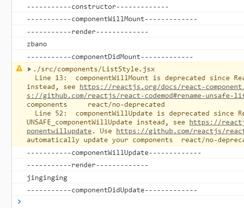

# React 总结
## 记住最重要一点 React就是一个原生写法的js
React 是 facebook 开源的一套框架，可总结为以下几个特点：

- 基于 JSX 语法糖实现
- JUST THE UI：在多层架构的设计模式中，React 并不算 MVC 的架构，它可理解为 MVC 的 V 层。
- VIRTUAL DOM：虚拟DOM，是轻量的 js 对象，只保留了原生 dom 的一些常用的属性和方法。
- DATA FLOW： React是单向响应的数据流。

# jsx语义
写法：{ } 只有单括号  
  如果要用这种写法文件必须jsx
```jsx
const template=<div>123a</div>
```
```js
const data = {
    title:"hello world",
    attr:"abc",
    url:"https://avatars2.githubusercontent.com/u/48898125?s=200&v=4"
}
const template=(
    <div>
    //自调用
     {(()=>{
        return '你好'
    })()}
    <p name={data.name}>{data.attr}</p>
    )
</div>
ReactDOM.render(
    template,
    //相当于el
    document.querySelector("#demo")
)
```
在属性里面写不用加"" 会把里面的内容当做字符串

# 组件
### 函数式编译
```jsx
//组件b
const React = require('react')
// 函数组件
// props组件通信 父传子
// 组件的本质是构造函数，调用组件的本质是实例化
function Function(props) {
    return <h1>函数组件, {props.name}</h1>;
}

// 导出组件
export default Function
```
```jsx
//组件A
//导入组件
import Function from './components/Function.jsx'
//在`template`里面添加组件 自定义要大写
<Function name="World" />
```
### Es6编译
```jsx
//没有data的时候
const React = require('react')
class Es6class extends React.Component {
    render() {
        return <h1>类组件, 
            {this.props.name}
            {this.props.skill}
        </h1>;
    }
}

export default Es6class
```
```js
//有data的时候
class Clock extends React.Component {
    // 构造器相当于参数
    constructor(props) {
        //继承 React.Component的一些属性和方法 用于继承 一定要写
        super(props);
        //  相当于data
        this.state = {
            name: 'zbano',
            name1: 'taotao'

        };
    }
```
没data的时候可以省略`constructor`方法
# 事件
```js
 testClick(num) {
        console.log(this, num)
        console.log(this.state.name)
        // M -> V
        // 只能通过setState来去改变state的值，从而更新视图
        this.setState({
            name: 'lemon'
        });
    }

render() {
    //引用data
        let {
            name,
            style
        } = this.state
        //里面返回的是字符串模板
        return (
            <div>
                <h1 style={style}>
                    名字为{name}
                </h1>
                {/* onclick -> onClick*/}
                <button onClick={this.testClick.bind(this, 1)}>绑定this</button>
                <button onClick={this.testClickWithoutThis}>没有绑定this</button>
            </div>
        );
    }
```
如果需要传参数要加`.bind()`里面写参数，如果要修改`data`里面的值 ，不能用Vue的方法，因为React单向数据绑定m->v层因此修改`data`里面的值要用this.setState()放方法
# 生命周期


```jsx
import { Component } from 'react'
export default class listStyle extends Component{
      // 构造器 初始化数据模型，没有虚拟DOM和真实DOM 相当于beforeCreate
    constructor(props){
        console.log('-----------constructor-------------')
        super(props);
        this.state={
            name:'toatoa'
        }
    }
     // react没有 编译前 编译后 beforeCreate created
    // 挂载前 相当于 beforeMount
    componentWillMount(){
         // 更改数据state，修改状态
         //ajax在可以这里触发
         console.log('-----------componentWillMount-------------')
       this.setState({
           name:'zbano'
       })
    }
    //挂载后
    componentDidMount() {
        // 更改数据state，修改状态
        // 虚拟DOM变成真实DOM
        // 获取真实DOM在这个生命周期里面
        console.log('-----------componentDidMount-------------')
       
        setTimeout(() => {
            this.setState({
                name: 'jinginging',
            })
        }, 1000)
    }
    render(){
            // 新的虚拟DOM和旧的虚拟DOM进行差异更新
            console.log('-----------render-------------')
            console.log(this.state.name)
            return <p>{this.state.name}</p>
       
    }
    // 性能优化的重要一环
    // shouldComponentUpdate(nextProps, nextState) {
    //     console.log('-----------shouldComponentUpdate-------------')
    //     console.log(this.state.name)
    //     // render的节流，减少render的触发从而提升性能
    //     // 返回true那就是触发render 如果返回false就不触发render
    //     if (this.state.name.length > 7) {
    //         return true
    //     }else{
    //         return false
    //     }
    // }
    componentWillUpdate() {
        // 虚拟DOM更新
        console.log('-----------componentWillUpdate-------------')
    }
    componentDidUpdate() {
        // 真实DOM更新
        console.log('-----------componentDidUpdate-------------')
    }
}
```
   
   

# redux

首先在`model`文件夹里面创建一个仓库
```jsx
export default {
    //仓库名称
    namespace: 'student',
    //仓库
    state: {
      name:'taoatoww'
    },
  
  
  
    reducers: {
      show(state, action) {
        return { ...state, ...action.payload };
      },
    },
  
  };
  
```
然后在`index.js`里面的第三步骤配置`redux`
```jsx
// 3. Model 配置redux
app.model(require('./models/example').default);
app.model(require('./models/student').default);
```
最后在路由组件里面连接仓库
### ES5方法
```jsx
import React from 'react';
import { connect } from 'dva';
import Redux from '../components/redux'

function redux(props) {
  //获取redux里面的值
  let {name} =props.student
  console.log(name);

  function show(){
    //修改rexux里面的值
     let store =props.dispatch({
       //找到里面的对应的方法
    type:'student/show',
    //要修改的值
    payload:{
      name:'zbano'
    }
 
  })
  console.log(store)
  }
 

    return (
    <div>
      <Redux name={name}/>  
      <button onClick={show}>点我我</button>
    </div>
  );
  
 
}

redux.propTypes = {
};

// 连接Model 调用connect去连接仓库  相当于vuex中的getters，该组件已经可以跟仓库通信
// 把仓库的值拿到组件里面 
//connect里面要用回调
export default connect((state)=>{
  return state
})(redux);

```
### ES6方法
```jsx
import { Component } from 'react';
import { connect } from 'dva';
import Redux from '../components/redux'
class redux extends Component {
  constructor(props) {
    super(props);
    this.state = {

    }
  }
  show() {
    //修改rexux里面的值
    let store = this.props.dispatch({
      //找到里面的对应的方法
      type: 'student/show',
      //要修改的值
      payload: {
        name: 'zbano'
      }

    })
    console.log(store)
  }

render(){
  //获取redux里面的值
let { name } = this.props.student
console.log(name);

  return (
    <div>
      <Redux name={name} />
      //事件一定要加bind(this),不然会报错
      <button onClick={this.show.bind(this)}>点我我</button>
    </div>
  );
}
}
// 连接Model 调用connect去连接仓库  相当于vuex中的getters，该组件已经可以跟仓库通信
// 把仓库的值拿到组件里面
export default connect((state) => {
  return state
})(redux);

```
也可以在组件里面获取共有变量
```jsx
import { Component } from "react";
import { List, TextareaItem } from 'antd-mobile';
import {connect} from 'dva'
import './TextareaItems.css'
//连接共有变量
export default connect((state)=>{
    return state
})(class TextareaItems extends Component {
    constructor(props) {
        super(props);
        this.state = {

        }
    }
    componentDidMount() {
        this.autoFocusInst.focus();
    }
    //挂载前
    componentWillMount(){
        //修改共有变量
        this.props.dispatch({
            type:'student/show', // 仓库名称/reducers中的方法
            payload:{           //修改值
                name:'zbano'
            }
        })
    }
    render() {
        //获取共有变量里的值
        let {name}=this.props.student
        return (
            <div>
                <List renderHeader={() => 'Customize to focus'}>
                    <TextareaItem
                        title="标题"
                        placeholder={name}
                        data-seed="logId"
                        ref={el => this.autoFocusInst = el}
                        autoHeight
                    />
                 
                </List>
            </div>
        )
    }
})
```
# 路由
#### 跳转路由
跳转路由有很多种  
 
1. 用传统原生的写法 :
    ```jsx
    location.href=""
    ```
    或
    ```html
     <a href="#/xainqing" >小元有话说（十一）</a>
    ```   
       
2. 用`Link`标签 :    
首先引入` Link`  
    ```jsx
    import { Link } from 'react-router-dom';
    ```
    `Link`标签相当于`a`标签
    ```jsx
      <Link to="/lu" style={{color:'black'}}>下载简书手机App</Link>
    ```
3. 函数式编程 :  
首先引入`routerRedux`  
    ```jsx
    import { routerRedux } from 'dva/router';
    ```
    创建方法
    ```jsx
    onLeftClick(){
            this.props.dispatch(routerRedux.push({
            pathname: 'lu'  //路由名字
            }))
        }
    
    ```