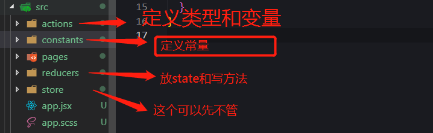

# Tora-Redux初体验
在生成项目的时候选择安装redux<br/><br/>
<br/><br/>
生成之后在`src`里面除了`pages`是知道的，其他的我来一一介绍一下   
`actions` 目录，用来放置所有的 actions  定义类型和变量  
`constants` 目录，用来放置所有的 action type 常量  
`reducers` 目录，用来放置所有的 reducers 放state和方法  
我们分别来看一下里面有什么  
## actions
```js
import {
  ADD,               //这里引的是constants里面定义的常量
  MINUS
} from '../constants/counter'

export const add = () => {
  return {
    type: ADD   //必写
  }
}
export const minus = () => {
  return {
    type: MINUS
  }
}

// 异步的action
export function asyncAdd () {
  return dispatch => {
    setTimeout(() => {
      dispatch(add())
    }, 2000)
  }
}

```
## constants
```js
export const ADD = 'ADD'    //数据多的时候可以把常量单独放在一个js文件里面
export const MINUS = 'MINUS'  
```
## reducers
```js
import { ADD, MINUS } from '../constants/counter'  //引常量

const INITIAL_STATE = {
  num: 0
}

export default function counter (state = INITIAL_STATE, action) {
  switch (action.type) {  //通过触发dispath获取type
    case ADD:
      return {
        ...state,
        num: state.num + 1
      }
     case MINUS:
       return {
         ...state,
         num: state.num - 1
       }
     default:
       return state
  }
}

```
如何调用是个问题,来看看index里面是怎么写的
```js
import Taro, { Component, stopRecord } from '@tarojs/taro'
import { View, Button, Text } from '@tarojs/components'
import { connect } from '@tarojs/redux'
//引用actions里面的type
import { add, minus, asyncAdd } from '../../actions/counter'

import './index.scss'

 //在触发之前一定要引用redux的connet方法
 // connect 方法将 redux 与我们的页面进行连接
 //把组件和store进行一次关联,就如果没有connect，这个仓库是没有任何人能访问的
@connect(({ states }) => ({
    // 第一个函数把store里面的值注入到`props`上面
    // 第一个函数是获取store的值
    //函数类型，接受最新的 state 作为参数，用于将 state 映射到组件的 props
    //绑定了props，取值用this.props.states

    // 和store的state产生关系
  states                
}), (dispatch) => ({
    // 第二个函数是触发store的值改变
    // 相当于vue（action，commit->mutation）
    // 你可以在此处定义多个函数，来去触发store里面的`dispatch`,从而改变`store`里面的值

    // 和store的action产生关系

  add () {
       //dispatch()里面传的是对象，相当于dva那样，只是taro把他们分出来了
    //dispatch({
    //    type:'',
    //    data:''
   // })

    dispatch(add())  
  },
  dec () {
    dispatch(minus())
  },
  asyncAdd () {
    dispatch(asyncAdd())
  }
}))
class Index extends Component {

    config = {
    navigationBarTitleText: '首页'
  }

  componentWillReceiveProps (nextProps) {
    console.log(this.props, nextProps)
  }

  render () {
    return (
      <View className='index'>
        <Button className='add_btn' onClick={this.props.add}>+</Button>
        <Button className='dec_btn' onClick={this.props.dec}>-</Button>
        <Button className='dec_btn' onClick={this.props.asyncAdd}>async</Button>
        <View><Text>{this.props.states.num}</Text></View>
        <View><Text>Hello, World</Text></View>
      </View>
    )
  }
}

export default Index

```
如果项目不大，没必要这么麻烦，比如说`constants`是可以不要的,所以我们来试一下
## 新建actions

```js
// import { ADD, MINUS } from '../constants/counter'  注释掉，不引constants

  export const updata = (data) => {  //先写一条试试水，可以传参
    return {
      type: 'UPDATA',
      data
    }
  }
  
```
## 新建reducers
```js
const TEST = {   //state库
  num: '名字'
}

export default function counter (state = TEST, action) {
  switch (action.type) {
    case 'UPDATA':
      return {
        ...state,
        num: action.data  //传入值
      }
    default:
      return state
  }
}

```
！！！注意 当你新建了一个`reducers`仓库,就要在`@/reducers/index.js`里面注册
```js
import { combineReducers } from 'redux'
import states from './counter'
import states1 from './test'  //新建的仓库

export default combineReducers({  //声明 注册
  states,
  states1
})

```
然后在新页面调用
```js
import Taro, { Component, stopRecord } from '@tarojs/taro'
import { View, Button, Text } from '@tarojs/components'
import { connect } from '@tarojs/redux'
//引用type
import { updata } from '../../actions/test'

import './index.scss'

//states1就是你注册的那个仓库
@connect(({ states1 }) => ({
  states1
}), (dispatch) => ({
  updata () {
    dispatch(updata(1)) //传入参数
  }
}))
class Test extends Component {

    config = {
    navigationBarTitleText: '首页'
  }

  componentWillReceiveProps (nextProps) {
    console.log(this.props, nextProps)
  }


  render () {
    return (
      <View className='index'>
        <Button className='add_btn' onClick={this.props.updata}>+</Button>
        <View><Text>{this.props.states1.num}</Text></View>
        <View><Text>Hello, World</Text></View>
      </View>
    )
  }
}

export default Test

```
Taro-redux初体验大概了解到这么多，以后有新的理解还会继续更新，有什么问题或建议可以在issues中留言，喜欢的请点个Star，谢啦


