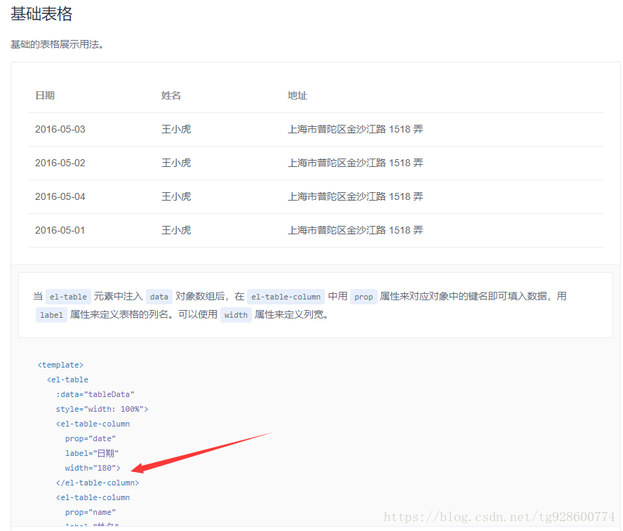
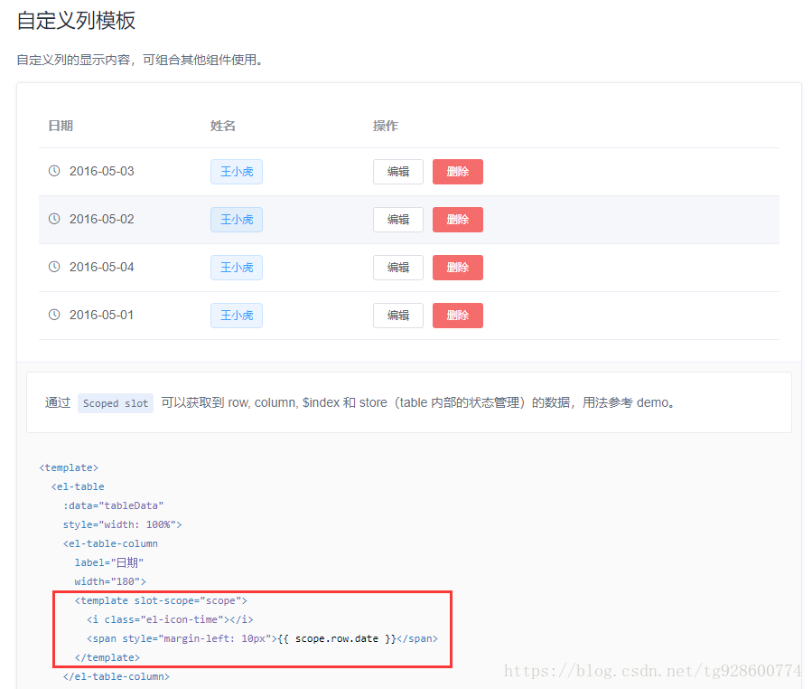

# Table组件和form表单
在后台系统中用得最多的想必就是`table`表格了，那我们用的时候会发现有两种写法:    
- 第一种:<br/><br/>
  <br/><br/>
不难发现遍历出来的值都是通过`prop`属性来实现的，这是基础的用法
- 第二种：<br/><br/>
  <br/><br/>
现在我们可以看到一种高级点的方法  
    ```Html
    <el-table-column
        label="日期"
        width="180">
        <template slot-scope="scope">   //不用prop，这样写可以更好的获取一整行里面的所有内容
            <i class="el-icon-time"></i>
            <span style="margin-left: 10px">{{ scope.row.date }}</span>
        </template>
    </el-table-column>

    ```
`form`表单也是我们经常使用的，比如说添加，修改信息啊，那我一般都会搭配一个弹窗来做，那如果修改和添加都用同一张表呢？
```Html
 <el-table-column label="操作" align="center">
        <template slot-scope="scope">
          <el-button
            type="primary"
            size="small"
            @click="dialogFormVisible = true, rows=scope, openInfo(submitFlag='modify',rows),dialogStatus='' "
          >修改信息</el-button>
          <el-button
            type="danger"
            size="small"
            @click="delOpen(deltype='',check='',scope.row.toKenId)"
          >删除</el-button>
        </template>
      </el-table-column>
```
```js

    // 打开弹窗
    openInfo(type, rows) {  //type固定传add和modify
    //需求是当你点开添加和修改都要请求接口
      let list1 = null
      if (type === 'add') { //判断是否是添加数据
        list1 = { submitFlag: type }
      } else {
        list1 = { toKenId: rows.row.toKenId, submitFlag: type }
      }
    
      getEdit(list1).then(res => {
          //通过后端返回的submitFlag，判断回显，并清空里面的内容
        if (res.data.submitFlag === 'add') {
          this.temp.codeP = null
          this.temp.rowSeq = null
          this.temp.itemName = null
          this.temp.isShrinkage = null
          this.temp.isRisk = null
          this.temp.isActive = null
          this.temp.submitFlag = res.data.submitFlag
          // console.log(11);
        } else {
          const {
            codeP,
            rowSeq,
            itemName,
            isShrinkage,
            isRisk,
            isActive,
            toKenId
          } = res.data.bdCostItemNewDetail

          this.temp.codeP = codeP
          this.temp.rowSeq = rowSeq
          this.temp.itemName = itemName
          this.temp.isShrinkage = (isShrinkage === 1)
          this.temp.isRisk = (isRisk === 1)
          this.temp.isActive = (isActive === 1)
          this.temp.toKenId = toKenId
          this.temp.submitFlag = res.data.submitFlag
        }
      })
    },

```
当你提交的表单的时候，肯定要传的两个参数：`tokenid`和`submitFlag `   
业务逻辑：当你提交添加的时候要传给后端的只有`submitFlag='add'`,当你提交修改的时候要传给后端的有`tokenid`用来识别当行的id，还有`submitFlag='modify'`  
那我们可以用一种最简单的方法就是在表单里面隐藏这两个`input`框
```html
  <el-form-item label="tokenId" prop="toKenId" hidden>
          <el-input v-model="temp.toKenId" hidden />
        </el-form-item>
        <el-form-item label="submitFlag" prop="submitFlag" hidden>
          <el-input v-model="temp.submitFlag" hidden />
        </el-form-item>
```
```js

    // 修改信息
    updateData(form, rows) {
        //es6语法
      const tempData = Object.assign({}, form)
      console.log(tempData)
      updateOperation(tempData).then(res => {
        if (res.code === 200) {
          this.dialogFormVisible = false
          this.$message({
            type: 'success',
            message: '修改成功!'
          })
          this.getList() //刷新页面
        } else {
          this.$message({
            type: 'error',
            message: '修改失败!'
          })
        }
      })
    },

```