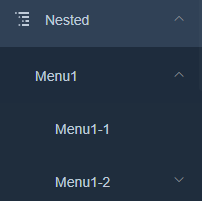
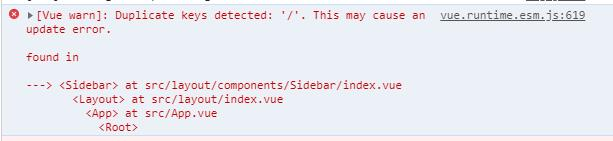
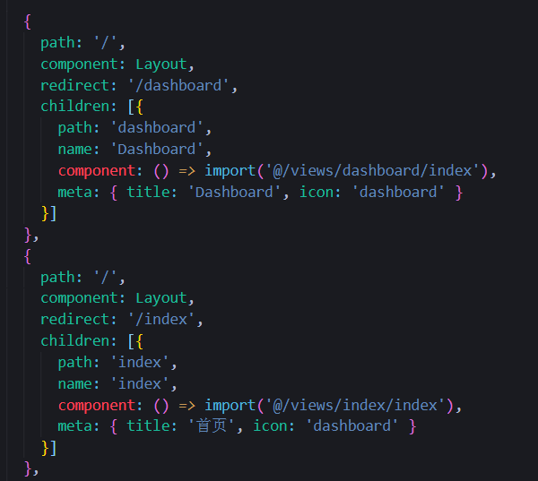

### 安装问题
一开始使用这个`Element-admin`的时候都会遇到一个问题，就是安装不成功，报的错都是一样`node-sass`安装失败的问题，然后我的解决方案是分别执行这两条命令： <br/> <br/> 
1、npm install sass-loader --save-dev  
2、npm install node-sass --save-dev   
### 多级目录的问题
- 一级路由   
如果想要在侧边栏里面添加一行就要在` @/router/index.js` 中增加你需要添加的路由  
    ```js
     {
        path: '/example',
        component: Layout,
        redirect: '/example/table',
        name: 'Example',
        meta: { title: 'Example', icon: 'example' }
     }
    ```
    如果想嵌套一层路由就要加个`children`,默认加一个嵌套并不会出现下拉条而且还会覆盖上一级的名称,因此要嵌套两个vai出现下拉条  
    ```js
     {
    path: '/example',
    component: Layout,
    redirect: '/example/table',
    name: 'Example',
    meta: { title: 'Example', icon: 'example' },
    children: [
      {
        path: 'table',
        name: 'Table',
        component: () => import('@/views/table/index'),
        meta: { title: 'Table' }
      },
      {
        path: 'complex-table',
        name: 'complex-table',
        component: () => import('@/views/table/complex-table'),
        meta: { title: 'Tcomplex-tableable'}
      }]
     }
    ```
- 三四级路由  
 三四级路由也叫无限嵌套,也就是这种 <br/>    
     <br/>    
 其实无非也是在`children`里面嵌套`children`,像这样
  ```js
    {
          path: 'tree',
          name: 'Tree',
          redirect: '/tree/tes/tes',
          component: () => import('@/views/tree/index'),
          meta: { title: 'Tree' },
          children:[
            {
              path:'tes',
              name:'tes',
              component: ()=> import('@/views/tree/tes/tes'),
              meta:{title:'tes'}
            },
            {
              path:'tesq',
              name:'tesq',
              component: ()=> import('@/views/tree/tes/tesq'),
              meta:{title:'tesq'}
            }
          ]
          
        }
  ```  
这样配置完还不行,还要在根目录下的`.vue`文件里面加上`<router-view/>`,这样才显示出来
 
 ### 控制台报错的问题
  - "/"报错问题  <br/>  <br/> 
    <br/>  <br/> 
   这里的报错指的是有重复的 '/'  
   解决办法 : 我们可以找到`router`文件夹下的`index.js` ,查找有没有重复的 "/" ，比如这种 <br/>  <br/> 
       <br/>  <br/> 
   直接把"/"去掉换成路径名
    