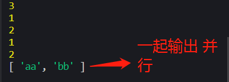

# Promise的使用
首先`Promise`是一个构造函数,那Promise是用来干嘛的，当然是解决回调地狱啦，我们先来认识一下，我们new一个玩玩  

```js
 let a = new Promise((resolve,reject)=>{
     //做一些异步操作
       setTimeout(()=>{
            console.log(1)
            resolve('aa')
        },2000)
    
    })
        }
```
Promise的构造函数接收一个参数，是函数，并且传入两个参数：resolve，reject，分别表示异步操作执行成功后的回调函数和异步操作执行失败后的回调函数。那怎么调用它呢？
```js
let a = ()=>{
    return new Promise((resolve,reject)=>{
        setTimeout(()=>{

            console.log(1)
            console.log(2)
          
        },1000)
        console.log(3)
        resolve('aa')  //return返回值，最后执行的一步
    })
}

a().then(res=>{  //用then获取返回数据
    console.log(res)  //3 aa 1 2
   
})
```
回调地狱如何解决？比方说a请求里面嵌套b请求，那这时候Promise链式操作就发挥作用啦
```js
let a= ()=>{
    return new Promise((resolve,rej)=>{
        setTimeout(()=>{
  
            console.log(1)
            console.log(2)
          
        },1000)
        console.log(3)
        resolve('aa')
    })
}

let b= ()=>{
    return new Promise((resolve,rej)=>{
        setTimeout(()=>{
           
            console.log(1)
            console.log(2)
            resolve('bb')
        },1000)
    
    })
}
a().then(res=>{
    console.log(res)
    return b()  //执行完这里 return b接着调用
}).then(res=>{
    console.log(res)
})
//输出：3 aa 1 2 1 2 bb
//先执行a 再执行b
```
## catch的用法
我们知道Promise对象除了then方法，还有一个catch方法,其实它和then的第二个参数一样，用来指定reject的回调，用法是这样
```js
a().then(res=>{
    console.log(res)
    console.log(aa) //aa 未定义
   
}).catch(rea=>{
    console.log(rea)  //aa is not defined
})

//输出：3 aa aa is not defined 1 2
```
效果和写在then的第二个参数里面一样。不过它还有另外一个作用：在执行resolve的回调（也就是上面then中的第一个参数）时，如果抛出异常了（代码出错了），那么并不会报错卡死js，而是会进到这个catch方法中
## all的用法
Promise的all方法提供了并行执行异步操作的能力，并且在所有异步操作执行完后才执行回调。
```js
Promise.all([a(),b()]).then(res=>{
    console.log(res)
})
```
用Promise.all来执行，all接收一个数组参数，里面的值最终都算返回Promise对象。这样，三个异步操作的并行执行的，等到它们都执行完后才会进到then里面。那么，三个异步操作返回的数据哪里去了呢？都在then里面呢，all会把所有异步操作的结果放进一个数组中传给then，就是上面的res。所以上面代码的输出结果就是:<br/><br/>
 <br/><br/> 
有了all，你就可以并行执行多个异步操作，并且在一个回调中处理所有的返回数据
## race的用法
all方法的效果实际上是「谁跑的慢，以谁为准执行回调」，那么相对的就有另一个方法「谁跑的快，以谁为准执行回调」，这就是race方法，这个词本来就是赛跑的意思。race的用法与all一样，我们把上面a的延时改为500毫秒来看一下：
```js
Promise.race([a(),b()]).then(res=>{
    console.log(res)
})

//输出：3 aa 1 2 1 2
```