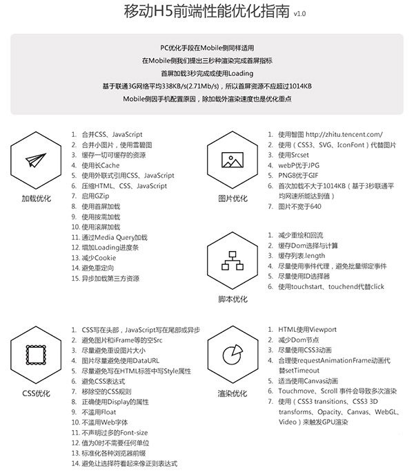
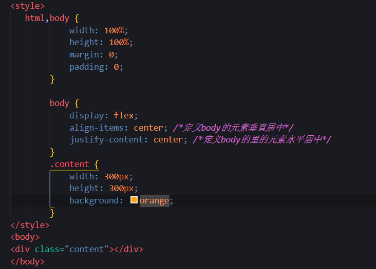

# 面试题
#### 1.mvc和mvvm的区别

它实现了`View`和`Model`的自动同步，也就是当`Model`的属性改变时，我们不用再自己手动操作Dom元素，来改变`View`的显示，而是改变属性后该属性对应`View`层显示会自动改变。

#### 2.什么是vue生命周期？

答： Vue 实例从创建到销毁的过程，就是vue的生命周期。Vue有创建前，创建后，挂载前，挂载后，更新前，更新后，销毁前，销毁后这8个阶段，通过这8个阶段可以更好控制整个vue实例的过程

#### 3.DOM 渲染在哪个周期中就已经完成？

答：DOM 渲染在 mounted 中就已经完成了。

#### 4.Vue的双向数据绑定原理

 它是通过数据劫持结合发布订阅者模式实现的,通过对象下的`defineProperty`的方法劫持各个属性下的`setter`和`getter`达到监听的作用,当数据发生变动时发布消息给订阅者，触发相应的监听回调，`defineProperty`有三个参数：
 - `obj` 
 - 对象的属性
 - 属性的描述符，描述符里面主要有两种形式：数据描述符和存取描述符
   - 数据描述符(可写)
   - 存取描述符由一对getter-setter函数功能来描述属性的    
##### 那是怎么实现的呢？  
通过过`Observer`来监听自己的`model`层数据变化，通过`Compile`来解析编译模板指令，最后利用`Watcher`搭起`Observer`和`Compile`之间的通信桥梁

#### 5.Vue路由原理
通过监听URL地址的变化，更新视图且不刷新。 
具体有两种模式  
1. hash模式  
当#号后面的值发生改变时，就会触发hashchange事件，那我们可以通过监听这个事件从而达到路由跳转
2. history模式
它是通过`pushstate`和`replaceState`这两个api改变 url 地址且不会发送请求，前端的 URL 必须和后端发起请求的`URL`一致，否则出现404

#### 6.vuex原理
vuex的原理其实非常简单，它为什么能实现所有的组件共享同一份数据？
因为vuex生成了一个`store`实例，并且把这个实例挂在了所有的组件上，所有的组件引用的都是同一个`store`实例。
`store`实例上有数据，有方法，方法改变的都是store实例上的数据。由于其他组件引用的是同样的实例，所以一个组件改变了store上的数据， 导致另一个组件上的数据也会改变，就像是一个对象的引用。
```
原理：vuex是一个状态管理模式。采用集中式存储管理应用的所有组件的状态，并以相应的规则保证状态以一种可预测的方式发生变化。通俗一点说：vue应用中统一管理数据的地方。
缺点：
1、复杂性
2、维护成本
```  

#### 7.箭头函数和普通函数有什么区别
- 函数体内的this对象，就是定义时所在的对象，而不是使用时所在的对象，用call apply bind也不能改变this指向
- 不可以当作构造函数，也就是说，不可以使用new命令，否则会抛出一个错误。
- 不可以使用arguments对象，该对象在函数体内不存在。如果要用，可以用 rest 参数代替。
- 不可以使用yield命令，因此箭头函数不能用作 Generator 函数。
- 箭头函数没有原型对象prototype

#### 8.Url回车：
1.dns域名解析  
2.Tcp连接 进行三次握手  
  第一次握手 客户端告诉服务端我发请求啦  
  第二次握手 服务器告诉客户端 我准备好了  
  第三次握手 客户端告诉服务端 ok 你接受吧  
3.此时进行客户端与服务端构建了一条隧道，客户端发送http请求给服务器，服务器处理并发送html文件给客户端，进行页面加载，页面加载分为6步  
    1.解析html结构  
    2.解析并加载外部js和css文件  
    3.解析脚本代码   
    4.Dom树的构建    
    5.加载图片和多媒体文件  
    6.页面加载完毕  
断开连接

#### 9.null和undefined的区别
null 表示一个对象是“没有值”的值，也就是值为“空”  
undefined 表示一个变量声明了没有初始化(赋值)  
undefined 和 null 在if语句中，都会被自动转为false  
undefined 不是一个有效的JSON，而 null 是  
undefined 的类型(typeof)是 undefined  
null 的类型(typeof)是 object  
Javascript将未赋值的变量默认值设为 undefined  
Javascript从来不会将变量设为 null。它是用来让程序员表明某个用var声明的变量时没有值的

#### 10.position的absolute与fixed共同点与不同点   
共同点：  
1.display默认设置为block  
2.脱离文档流  
3.默认会覆盖非定位元素上      
不同点：  
absolute相对于第一个父元素进行定位     
fixed浏览器窗口进行定位   

### 11.页面性能优化
请求优化  
1.减少请求数  
1.懒加载  
2.雪碧图  
3.合并CSS、JS  
2.减少请求量  
3.合理利用缓存  
4.CDN  
5.http2 || keep-alive    


#### 12.call()、apply()和bind()的区别：
1.都能改变this的指向  
2.call()/apply()是立即调用函数  
3.bind()：绑定完this后，不会立即调用当前函数，而是将函数返回，因此后面还需要再加()才能调用。  
PS：bind()传参的方式和call()一样。  
分析：  
为什么ES5中要加入bind()方法来改变this的指向呢？因为bind()不会立即调用当前函数。  
bind()通常使用在回调函数中，因为回调函数并不会立即调用。如果你希望在回调函数中改变this，不妨使用bind()。  

#### 14.箭头函数的特性：
不绑定this，argument  
箭头函数的this是在定义函数时绑定  

#### 15.闭包                                                      
闭包是一个能够读取其他函数内部变量的函数，本质上，闭包是将函数内部和函数外部连接起来的一个桥梁。  
闭包的特性：  
1.函数内嵌套函数  
2.内部函数可以引用外层的参数和变量  
3.参数和变量不会被垃圾回收机制回收  

①.封闭性：外界无法访问闭包内部的数据，如果在闭包内声明变量，外界是无法访问的，除非闭包主动向外界提供访问接口；  
②.持久性：一般的函数，调用完毕之后，系统自动注销函数，而对于闭包来说，在外部函数被调用之后，闭包结构依然保存在  
系统中，闭包中的数据依然存在，从而实现对数据的持久使用。  
优点：  
① 减少全局变量。  
② 减少传递函数的参数量    
③ 封装；  
   缺点： 使用闭包会占有内存资源，过多的使用闭包会导致内存溢出等.

#### 16.移动端1px问题的解决办法
 1. 伪类 + `transform` 实现
    - 原理是把原先元素的 `border` 去掉，然后利用 `:before` 或者 `:after` 重做` border` ，并` transform` 的 `scale` 缩小一半，原先的元素相对定位，新做的 border 绝对定位。  
    优点：所有场景都能满足，支持圆角(伪类和本体类都需要加border-radius)  
    缺点：对于已经使用伪类的元素(例如clearfix)，可能需要多层嵌套
2. 使用`box-shadow`模拟边框
    - 利用css 对阴影处理的方式实现0.5px的效果  
      优点：代码量少，可以满足所有场景  
      缺点：边框有阴影，颜色变浅
3. 修改`meta`标签里面的`content`属性，设置宽度为设计图的宽度

#### 17.数组去重的方法
1. 利用ES6 Set去重(不考虑兼容性，这种去重的方法代码最少)  
    Array.from()方法就是将一个类数组对象或者可遍历对象转换成一个真正的数组。
    ```js
      var arr =[1,1,'true','true',true,true,15,15,false,false,undefined,undefined, null,null,NaN,NaN,'NaN', 0,0,'a','a', {}, {} ];

    function test(arr) {
        return Array.from(new Set(arr)); //将Set结构的数据转换为真正的数组
    }
    或
    let set =[...new Set(arr)]
    console.log(set)
    console.log(test(arr))
    ```
2. 利用`indexOf`去重
    ```js
    var arr = [10, 20, 10, 11, 100, 20, 10, 30];
        var arr1=[];
    for(var i=0;i<arr.length;i++){
        if(arr1.indexOf(arr[i])==-1){
            arr1.push(arr[i]);
        }
    }
    console.log(arr1)
    ```
3. 嵌套循环
   ```js
     var arr = [10, 20, 10, 11, 100, 20, 10, 30]; //[10,20,11,100,30]

            var newarr = [];

            for (var i = 0; i < arr.length; i++) {
               for(var j =1;j<arr.length;j++){
                    if(arr[i]==arr[j]){
                        newarr.push(arr[j])
                    }
               }

            }

    console.log(newarr);
    ```

#### 18.跨域解决问题 
 
1. jsonp  
既然它叫jsonp，很明显目的还是json，而且是跨域获取。根据上面的分析，很容易想到：利用js构造一个script标签，把json的url赋给script的scr属性，把这个script插入到dom里，让浏览器去获取
服务器端集成Script tags返回至客户端，通过javascript callback的形式实现跨域访问（这仅仅是JSONP简单的实现形式）。  
JSONP 是JSON with padding（填充式JSON 或参数式JSON）的简写。  
JSONP是一种可以绕过浏览器的安全限制，从不同的域请求数据的方法。  
JSONP请求不是ajax请求，是利用script标签能加载其他域名的js文件的原理，来实现跨域数据的请求     
	特点：  
	1.只能为get请求  
	2.接口必须有回调函数的执行  
	3.支持所有浏览器，因为它是script标签  

2. 服务器代理  
由于浏览器有同源策略限制，（同源策略即协议域名端口相同），所以想要跨域访问其他域下的资源，需要绕开浏览器的这个限制，可以在服务器端设置一个代理，由服务器端向跨域下的网站发出请求，再将请求结果返回给前端，成功避免同源策略的限制。  
此时前端相当于不跨域，和正常请求一致，无需额外配置。  
灵活性：不同环境服务域名可能不一致，因此nginx配置也不相同，不便于移植。


3. CORS  
CORS是跨源资源分享（Cross-Origin Resource Sharing）的缩写，它为Web服务器定义了一种方式，允许网页从不同的域访问其资源。  
优点  
1、 JSONP只能实现GET请求，而CORS支持所有类型的HTTP请求。  
2、 使用CORS，开发者可以使用普通的XMLHttpRequest发起请求和获得数据，比起JSONP有更好的错误处理。   
3.CORS不支持IE8以下浏览器，但是绝大多数现代浏览器都已经支持了CORS。
4.灵活性，只需要在代码或者配置中心进行黑白名单配置即可，方便一直和拓展。
  
总结：  
1.CORS与JSONP相比，更为先进，方便和可靠  
2.开发者可以使用普通的XMLHttpRequest发起请求和获得数据，比起JSONP有更好的错误处理  
3.公共即相互，涉及到对接的前端项目比较多，开发部署环境比较多，整体来将我个人推荐使用cors的方案，而对于一些对立性强的小项目，使用服务器代理可以降低成本，结合工作实际，按需使用，使用服务器代理方案是，最好使用内部域名/ip作为接口。


#### 19.promise可以解决回调地狱的底层原理是什么

回调地狱是因为异步回调函数嵌套太多。

​	Promise的内部也有一个 `defers` 队列存放事件，而 `.then` 方法的作用和发布订阅模式的on方法一样是用来订阅事件的，每次调用 `.then` 方法就会往defers队列中放入一个事件，当异步操作完成时， `resolve方法标示前一个异步过程完成并从defers队列中取出第一个事件执行并返回当前对象保证链式调用，以此类推，就完成了所有异步过程的队列执行。`

#### 20.vue和react的区别

相同点：
1、都支持服务器渲染
2、组件化开发
3、都有管理状态，vue有vuex,react有redux
不同点：
1、react严格上只针对MVC的view层，Vue是MVVM模式
2、数据绑定：vue实现数据的双向绑定。react的数据流动是单向的
3、组件写法不一样，react推荐做法是jsx+inline style，也就是把html和css全部写进js里面；vue推荐做法是webpack+vue-loader的单文件组件格式，就是把html、css、js写在同一个文件夹里

#### 21.react的高阶组件是什么

高阶组件是一个函数，接收一个组件，然后返回一个新的组件，虽然名称是高阶组件，但是高阶组件不是组件，而是函数


#### 22.请说下封装 vue 组件的过程？

答：首先，组件可以提升整个项目的开发效率。能够把页面抽象成多个相对独立的模块，解决了我们传统项目开发：效率低、难维护、复用性等问题。
然后，使用Vue.extend方法创建一个组件，然后使用Vue.component方法注册组件。子组件需要数据，可以在props中接受定义。而子组件修改好数据后，想把数据传递给父组件。可以采用emit方法。

#### 23.new操作符具体干了什么？
1. 创建一个空对象，并且this变量引用该对象，同时还继承了该函数的原型
2. 属性和方法被加入到ths的引用的对象中
3. 新创建的对象由this所引用，并且最后隐式的返回this

#### 24.小程序的生命周期
 全局生命周期  
 onLaunch    --监听小程序初始化   
 onShow      --监听小程序启动  
 onHide      --监听小程序切换后台  

 页面的生命周期  
onLoad      --监听页面加载
onReady     --监听页面初次渲染

#### 25.v-if和v-show的区别
v-if 是利用dom节点的重建和销毁达到显示隐藏  一般用于后台系统权限那边  
v-show  相当于css里面的display，显示隐藏 一般用于前端页面

#### 26.盒模型
CSS盒模型和IE盒模型的区别：

在 标准盒子模型中，width 和 height 指的是内容区域的宽度和高度。增加内边距、边框和外边距不会影响内容区域的尺寸，但是会增加元素框的总尺寸。

IE盒子模型中，width 和 height 指的是内容区域+border+padding的宽度和高度。

#### 27.Cookie、LocalStorage 与 SessionStorage的区别
cookie 要配合服务器一起使用,可以设置失效时间。默认是关闭浏览器后失效，存放数据大小4k左右，自动携带cookie给服务器  
而sessionStorage和localStorage不会自动把数据发给服务器,仅保存在本地,存放数据可存5M左右

区别在于  
localStorage的生命周期是永久,他们还有一个作用域不同,localStorage在所有同源窗口中都是共享的,sessionStorage通过点击链接（或者用了 window.open）打开的新标签页之间是属于同一个 session 的，但新开一个标签页总是会初始化一个新的 session

#### 28.gulp与webpack的区别
gulp：强调的是前端开发的流程，通过配置一系列的task，定义task处理的事物（例如文件压缩合并、雪碧图、启动server、 版本控制等），然后定义执行顺序，来让gulp执行task，从而构建前端项目的流程。  

webpack：是一个前端模块化方案，侧重模块打包，把开发中的所有资源（图片、js文件、css文件等）都看成模块，通过loader（加载器）和plugins（插件）对资源进行处理，打包成符合生产环境部署的前端资源。  

相同：可以文件合并与压缩（css）  


#### 29.mvvm框架是什么？和其他框架有什么区别（jQuery）?适用于什么场景？
mvvm 是 model + view + viewmodel的缩写  
Model代表数据模型，也可以在Model中定义数据修改和操作的业务逻辑。  
View 代表UI 组件，它负责将数据模型转化成UI 展现出来。  
ViewModel 是一个同步View 和 Model的对象，用于连接Model和View。  
区别：vue 是数据驱动，通过数据来改变视图层而不是操作节点
场景：数据操作比较多的场景，更加快捷  

#### 30.data为什么是个函数而不是对象？
因为对象是对地址的引用，当你改变其中一个值的时候，其他也会改变，相对于函数来话，函数里面有一个作用域的概念，所以他们相互独立，不受影响。

#### 31.css水平垂直居中
1. margin:0 auto; position: relative; top:50%; margin-top:-50%  
2. margin:0 auto; position: relative; top:50%; transform: translateY(-50%)  
3. 弹性布局：  
  
#### 32.$route和$router的区别
答：$route是“路由信息对象”，包括path，params，hash，query，fullPath，matched，name等路由信息参数。而$router是“路由实例”对象包括了路由的跳转方法，钩子函数等

#### 33.vue-router 有哪几种导航钩子?
全局导航钩子  
router.beforeEach(to, from, next),  
router.beforeResolve(to, from, next),  
router.afterEach(to, from ,next)  
组件内钩子  
beforeRouteEnter,  
beforeRouteUpdate,  
beforeRouteLeave  
单独路由独享组件  
beforeEnter  
  
每个守卫方法接收三个参数：  
to: Route: 即将要进入的目标 路由对象  
from: Route: 当前导航正要离开的路由  
next: Function: 一定要调用该方法来 resolve 这个钩子。执行效果依赖   next 方法的调用参数。  

#### 34.axios的特点和使用
特点：基于promise的Http库，支持promise的所有API，用来请求和响应数据的，而且对响应回来的数据自动转化为json类型，安全性较高，客户端支持防御XRSF(跨站请求伪造)，默认不携带cookie;
